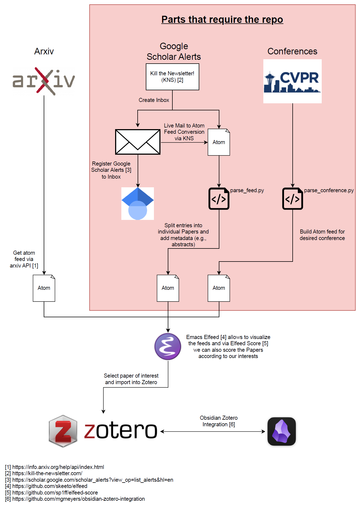

# PaperStream
PaperStream is a package designed to help you stay up to date with the latest research by enabling you to create a 
workflow tailored to your specific needs. Whether you're tracking new papers from conferences or organizing alerts into 
a personalized feed, PaperStream provides the tools to streamline your research process.

The package consists out of two core functionalities:
- **Paper/Journal Parsing**: Automatically parse your favorite conferences to scope through their papers. Having access to 
the title, authors and abstract allows for custom filtering based on your interest.
- **Feed Parsing**: Use to power of Google Scholar Alerts and convert them to your personal feed. The feed completes the 
alert info to give you not just the title but also the abstract at a glance.


## Paper/Journal Parsing
The parser retrieves and organizes the papers containing the Title, Authors, Abstract and fulltext URL from a multitude 
of proceedings within a few seconds.  You can parse all proceedings yourself with one package. Hence, you do not depend 
on multiple repositories or other people, which provide already parsed files.

The currently supported proceedings are focused towards machine learning and computer vision. The supported proceedings 
are:
- **CVF**:
  - _CVPR_ (starting 2013)
  - _ICCV_ (starting 2013)
  - _WACV_ (starting 2020)
- **ECVA**:
  - _ECCV_ (starting 2018)
- **PLMR**:
  - _ICML_ (starting 2020)
  - _AISTATS_ (starting 2020)
  - _CORL_ (starting 2020)
- _BMVC_ (starting 2022)
- _NIPS_ (all)*
- _AAAI_ (starting 2020)*
- **Openreview**:
  - _ICLR_ (starting 2020)
- **IEEE** (requires an API Key, register [here](https://developer.ieee.org/))
  - _IROS_ (all - starting 1988)
  - _ICRA_ (all - starting 1984)
  - _TPAMI_ (all - starting 1979)

*Indicates that the request_limit in ```config.py``` might need to be decreased due to DDOS protections or timeouts.

While we do not support all years or all proceedings from each publisher by default, most classes are easily extendable 
for those requirements. The openreview API can be clunky due to inconsistent behaviour. We also provide already parsed 
versions of the listed conferences/journals [here](https://drive.google.com/drive/folders/17_O6-b6CH0adDKWXb_otoOZik7M7FtPV?usp=sharing).

NOTE: The IEEE API allows 200 cals per day, where a single conference usually requires around 5-10 calls. Theoretically 
IEEE proceedings could be web-scraped, but it requires significant overhead.

In case you would like to see other conferences/journals feel free to create an issue or directly implement it and open 
up a pull request.

### Usage
In order to parse a proceeding just call the ```parsing_proceeding.py``` script like this:

```shell
python parsing_proceeding.py -c CVPR -y 2023
```

By default, a json file is returned, however, csv and atom files are also supported using the ```-f``` argument. If you 
use a API keys, you can create the ```misc/credentials.yaml``` file, which follows the pattern of the dummy 
file ```dummy_credentials.yaml```.


# Feed Parsing
Google Scholar Alerts are an excellent and user-friendly tool for staying updated on new research. However, managing 
these alerts through email can be inefficient, as emails are often overlooked during busy days, especially when 
dedicated time for reading recommendations isn't available.

This repository offers a streamlined solution by enabling you to build a dedicated research paper feed or inbox focused 
solely on paper notifications—free from other distractions.

Using the service [Kill the Newsletter!](https://kill-the-newsletter.com/), Google Scholar alert emails can be converted
into Atom feeds. While this conversion is convenient, the resulting feeds often contain limited and abbreviated 
information. This package enhances the utility of these feeds by completing the information with details such as 
authors and abstracts to the full papers.


The package enhances the limited information provided in the raw feeds by postprocessing the data. It retrieves 
additional details such as authors, abstracts, and links to full papers for supported publishers.

Currently, information completion is supported for the following publishers:
- Arxiv (does not require an API key) - Thank you for arXiv for use of its open access interoperability.
- IEEE (register [here](https://developer.ieee.org/docs))
- Elsevier / Sciencedirect (register [here](https://dev.elsevier.com/)); webparsing is not supported as simple requests are blocked
- Springer / Nature (register [here](https://dev.springernature.com/))

While some data can be retrieved without APIs, using API keys is strongly recommended for a more stable and faster 
experience. In case IEEE or Springer requests fail due to rate limits or other issues, the script will automatically 
fall back to a web-based scraping method. For Elsevier, the API limits are generous and unlikely to be exceeded under 
normal usage.

For publishers not listed above, the tool relies solely on the information provided in the original alert feed.

To better understand how this component works, please refer to the exemplary workflow described in the documentation.

## Usage
Start by creating an inbox on https://kill-the-newsletter.com/ and use it to subscribe to your Google Scholar 
alert/s. Do not forget to store the provided xml link, as the feed information is aggregated there. This means, as soon 
as a new mail is sent by Google Scholar, it is appended to the xml. 

If you want to parse a single feed file there are 4 important flags:
- ```-s```: The path of the source file (xml feed file produces by kill the newsletter), which can be a url.
- ```-t```: The name of the target file, which is used in your feed reader later.
- ```-o```: Information if the source file is stored online or locally.
- ```-a```: Should the result be appended to the existing target file or be overwritten
- ```-f```: Force parsing and ignore known errors with the risk of less information completion

The following code illustrates the usage with an example:
```shell
python parse_conference.py -s gs_feed.xml -t https://parsed_feed.xml -o True -a True
```

This works good for a single feed, but if you have multiple feeds (e.g., to keep the topics separated) it gets laborious.
Therefore, you can define a constant source to target file mapping by creating the ```misc/config.yaml``` file. See 
```misc/dummy_config.yaml``` for reference. You can enable this option by setting the flag ```-u``` to ```True```. 
NOTE: Using the ```-u``` flag runs the script solely based on the config file and no other info is required.

In case you want to avoid duplicates, you have the option to remove duplicates in the feed with ```--remove_within```  
or across all feeds ```--remove_across```. There might be still duplicates in your feed, if duplicates are found in 
later parses, because feed viewer usually only update based on new entries.

As stated above, you can create the file ```misc/credentials.yaml``` and add your API keys there, following the pattern 
of the dummy file ```dummy_credentials.yaml```.


# Installation
Due to minimal dependencies the installation is straightforward. The code requires Python >= 3.12, due to some itertools
functionality. Other than that, you can install all packages via the command:
```bash
pip install -r requirements.txt
```


# Exemplary Workflow
This package enables a feed based workflow which relies on xml (atom) files. By using both core functionalities you can 
integrate your desired conferences/journals and/or incorporate Google Scholar alters as well. Arxiv papers can also be 
integrated via the openly available API.

By using an atom feed, any feed reader of your liking can be used. In my current workflow I use elfeed which I highly 
recommend. If you decide to use elfeed I encourage you to try https://github.com/sp1ff/elfeed-score, which lets you 
rank your paper feed based on your preferences.

In order to get the Google Scholar alerts as xml files, kill the newsletter is used. Therefore, create an email on 
their webpage and use it to register for your alert. I recommend using one mail per alert to split them w.r.t. topics. 
Do not forget to store the provided xml link, as the feed information is aggregated there. Next, activate the URL 
(see section Google Scholar confirmation). Subsequently, add the feeds to ```misc/feed_config.yaml``` for parsing them.

Finally, all parsed xml files are linked to my feed reader (emacs) and in there filtered and ranked based on my interest.

The idea of using elfeed in combination with arxiv was inspired by https://cundy.me/post/elfeed/. 

My current workflow is shown in the image below.

<p align="center">
    
</p>

## Google Scholar Confirmation
Setting up the workflow requires you to activate the feeds you used.

### Automatically
You can use the script ```scholar_auto_activate.py``` to confirm all of your alerts automatically. Simply pass your 
online feed urls with the flag ```-f``` as shown in following. You can also pass multiple urls at the same time by 
leaving a space inbetween them.

```shell
python scholar_auto_activate.py -f https://kill-the-newsletter.com/feeds/abcdefg.xml
```

### Manually
Open the xml file you received via the kill the newsletter link. 
In there you should find a substring similar to `http://scholar.google.com/scholar_alerts?update_op=confirm_alert&#x26;amp;hl=en&#x26;amp;email_for_op=6ti0vasfasttads%40kill-the-newsletter.com&#x26;amp;alert_id=Y_NB9sdffrAJ&#x22;`.

You need to reformat into a valid link:
```python
str = "http://scholar.google.com/scholar_alerts?update_op=confirm_alert&#x26;amp;hl=en&#x26;amp;email_for_op=6ti0vasfasttads%40kill-the-newsletter.com&#x26;amp;alert_id=Y_NB9sdffrAJ&#x22;"
print(str.replace("amp;", "&").replace(";", "").replace("#", ""))
```
Enter the resulting url into your browser to execute the confirmation.


